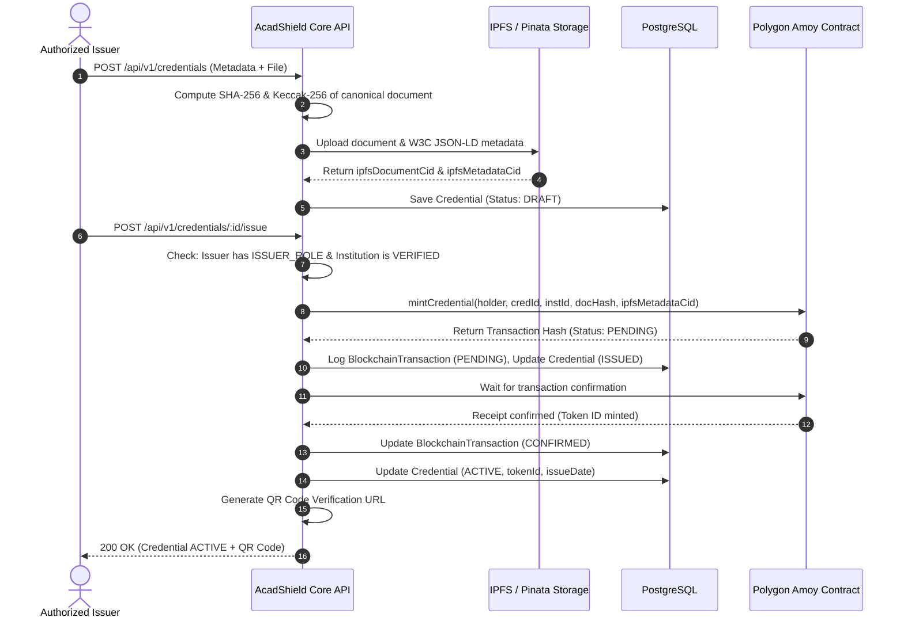

# ACADSHIELD CORE — ARCHITECTURAL SPECIFICATION

## System Invariants
1. **Zero Fake Trust Scores**: AcadShield Core does not generate heuristic or speculative fraud scores. It reports exact, deterministic verification states:
   - `VERIFIED`
   - `REVOKED`
   - `EXPIRED`
   - `INVALID`
   - `ISSUER_NOT_VERIFIED`
   - `NOT_FOUND`
   - `HASH_MISMATCH`
   - `BLOCKCHAIN_MISMATCH`
2. **Blockchain Transaction Confirmation Rule**: A credential record in PostgreSQL cannot transition from `ISSUED` to `ACTIVE` unless the associated on-chain transaction receipt is returned with status `1` (Success). If a transaction reverts or fails, the database status records the failure reason and reverts the credential to `DRAFT` or `FAILED`.
3. **Decentralized Identifiers (DID)**:
   - Student: `did:acadshield:student:<uuid>`
   - Institution: `did:acadshield:institution:<uuid>`
   - Issuer: `did:acadshield:issuer:<uuid>`
4. **Append-Only Audit Trail**: Every security, identity, status transition, or verification event generates an immutable record in the `AuditLog` table. Records cannot be updated or deleted.

---

## Component Interaction Flow

